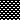
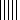
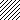
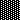

# Write style

Style can be applied to a cell.

```javascript
"style": {
  "border": [{}],
  "fill": {},
  "font": {},
  "alignment": {},
  "protection": {}
}
```

Style contains the following fields :

* An array of `border`
* A `fill`object
* A `font`object
* An `alignment` object
* A `protection` object

## Border reference

```javascript
"border": [{
  "type": "top",
  "color": "#000000",
  "style": 1
}]
```

Type represent border position

| type |
| :--- |
| top |
| bottom |
| left |
| right |

Style represent border style

| style | value |
| :--- | :--- |
| 0 | None |
| 1 | Continuous |
| 2 | Continuous with double lines |
| 3 | Dash |
| 4 | Dot |
| 5 | Continuous with 3 lines |
| 6 | Double |
| 7 | Continuous with no line |
| 8 | Dash with 2 lines |
| 9 | Dash Dot |
| 10 | Dash Dot with 2 lines |
| 11 | Dash Dot Dot |
| 12 | Dash Dot Dot with 2 lines |
| 13 | Slant Dash Dot |

## Fill reference

```javascript
"fill": {
  "type":"pattern",
  "color": "",
  "pattern": 1,
  "shading":1
}
```

| pattern |  |  |  |
| :--- | :--- | :--- | :--- |
| 0 | None | 10 |  |
| 1 |  | 11 |  |
| 2 |  | 12 |  |
| 3 |  | 13 |  |
| 4 |  | 14 |  |
| 5 |  | 15 |  |
| 6 |  | 16 |  |
| 7 |  | 17 |  |
| 8 |  | 18 |  |
| 9 |  |  |  |

| shading |  |
| :--- | :--- |
| 0 | Horizontal |
| 1 | Vertical |
| 2 | Diagonal up |
| 3 | Diagonal down |
| 4 | From corner |
| 5 | From center |

## Font reference

```javascript
"font": {
  "bold": true, // Boolean value
  "italic": false, // Boolean value
  "underline": "single",
  "family": "Times New Roman",
  "size": 14.5,
  "strike": true, // Boolean value
  "color": ""
}
```

| underligne |
| :--- |
| single |
| double |

## Alignment reference

```javascript
"alignment": {
  "horizontal": "left",
  "vertical": "top",
  "shrink_to_fit": false, // Boolean value
  "wrap_text": true // Boolean value
}
```

| horizontal |
| :--- |
| left |
| center |
| right |
| fill |
| justify |
| centerContinous |
| distributed |

| vertical |
| :--- |
| top |
| center |
| justify |
| distributed |

## Protection reference

```javascript
"protection": {
  "hidden": true, // Boolean value
  "locked": false // Boolean value
}
```

