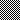

### Write style

Style can be applied to a cell.

```json
"style": {
  "border": [{}],
  "fill": {},
  "font": {},
  "alignment": {},
  "protection": {}
}
```

Style contains the following fields :

- An array of ```border ```
- A ```fill ```object
- A ```font ```object
- An ```alignment ``` object
- A ```protection ``` object

#### Border reference

```json
"border": [{
  "type": "top",
  "color": "#000000",
  "style":1
}]
```

Type represent border position

| type |
| ----------- |
| top |
| bottom |
| left |
| right |

Style represent border style

| style | value |
| ----------- | ----------- |
| 0 | None
| 1 | Continuous
| 2 | Continuous with double lines
| 3 | Dash
| 4 | Dot
| 5 | Continuous with 3 lines
| 6 | Double
| 7 | Continuous with no line
| 8 | Dash with 2 lines
| 9 | Dash Dot
| 10 | Dash Dot with 2 lines
| 11 | Dash Dot Dot
| 12 | Dash Dot Dot with 2 lines
| 13 | SlantDash Dot

#### Fill reference

```json
"fill": {
  "type":"pattern",
  "color": "",
  "pattern": 1,
  "shading":1
}
```

| pattern |
| ---------- | ---------- | ---------- | ---------- |
| 0 | None | 10 | |
| 1 |  | 11 | |
| 2 | | 12 | |
| 3 | | 13 | |
| 4 | | 14 | |
| 5 | | 15 | |
| 6 | | 16 | |
| 7 | | 17 | |
| 8 | | 18 | |
| 9 | |

| shading |
| ---------- | ---------- |
| 0 | Horizontal
| 1 | Vertical
| 2 | Diagonal up
| 3 | Diagonal down
| 4 | From corner
| 5 | From center


#### Font reference

```json
"font": {
  "bold": true/false,
  "italic": true/false,
  "underline": "single",
  "family": "Times New Roman",
  "size": 14.5,
  "strike": true/false,
  "color": ""
}
```

| underligne |
| ------------- |
| single |
| double |

#### Alignment reference

```json
"alignment": {
  "horizontal":"",
  "vertical": "",
  "shrink_to_fit": true/false,
  "wrap_text": true/false
}
```

| horizontal |
| ------------- |
| left |
| center |
| right |
| fill |
| justify |
| centerContinous |
| distributed |


| vertical |
| ------------- |
| top |
| center |
| justify |
| distributed |


#### Protection reference

```json
"protection": {
  "hidden": true/false,
  "locked": true/false
}

```
